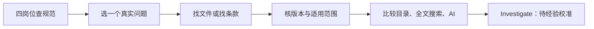
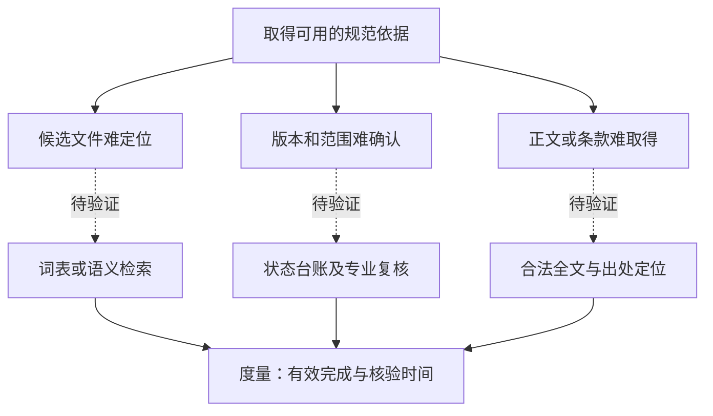
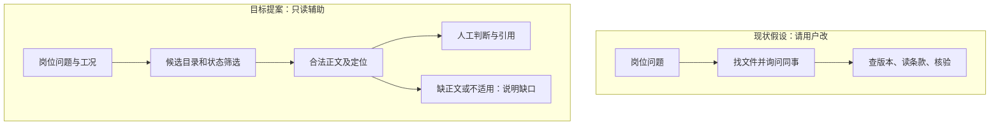
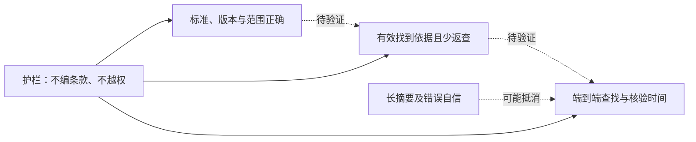

# 四类图：均为待校准问题模型

## diagnosis

```mermaid
flowchart LR
 A["四岗位查规范"] --> B["选一个真实问题"]
 B --> C["找文件或找条款"]
 C --> D["核版本与适用范围"]
 D --> E["比较目录、全文搜索、AI"]
 E --> F["Investigate：待经验校准"]
```

## problem-tree

```mermaid
flowchart TD
 A["取得可用的规范依据"] --> B["候选文件难定位"]
 A --> C["版本和范围难确认"]
 A --> D["正文或条款难取得"]
 B -. "待验证" .-> E["词表或语义检索"]
 C -. "待验证" .-> F["状态台账及专业复核"]
 D -. "待验证" .-> G["合法全文与出处定位"]
 E --> H["度量：有效完成与核验时间"]
 F --> H
 G --> H
```

## workflow

```mermaid
flowchart TB
 subgraph current["现状假设：请用户改"]
 A["岗位问题"] --> B["找文件并询问同事"] --> C["查版本、读条款、核验"]
 end
 subgraph proposed["目标提案：只读辅助"]
 D["岗位问题与工况"] --> E["候选目录和状态筛选"] --> F["合法正文及定位"] --> G["人工判断与引用"]
 F --> H["缺正文或不适用：说明缺口"]
 end
```

## metrics

```mermaid
flowchart LR
 A["标准、版本与范围正确"] -. "待验证" .-> B["有效找到依据且少返查"]
 B -. "待验证" .-> C["端到端查找与核验时间"]
 D["长摘要及错误自信"] -. "可能抵消" .-> C
 E["护栏：不编条款、不越权"] --> A
 E --> B
 E --> C
```

图表达任务与因果假设，不证明客户流程已被观察。
