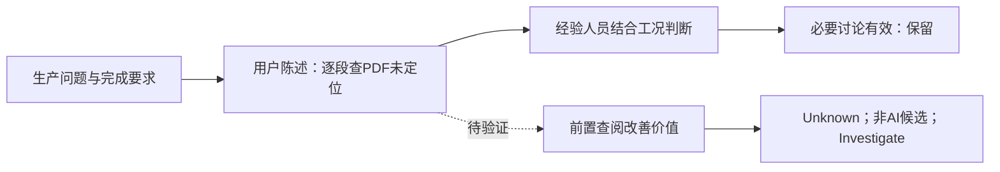
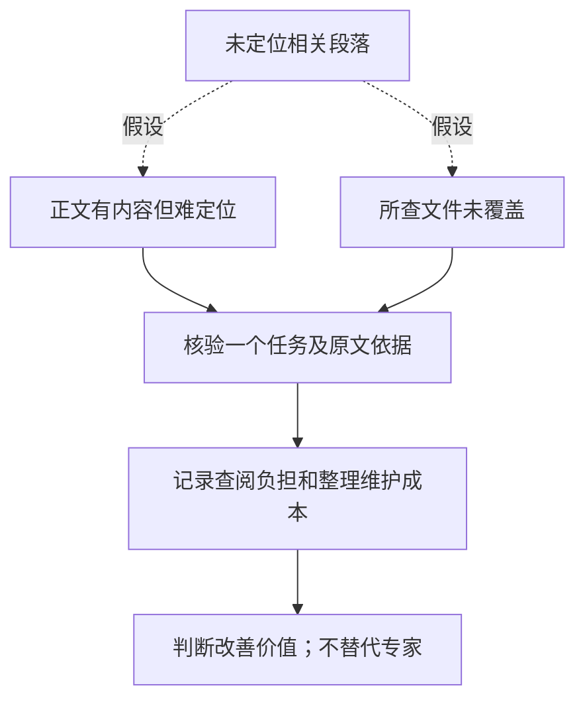
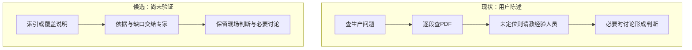
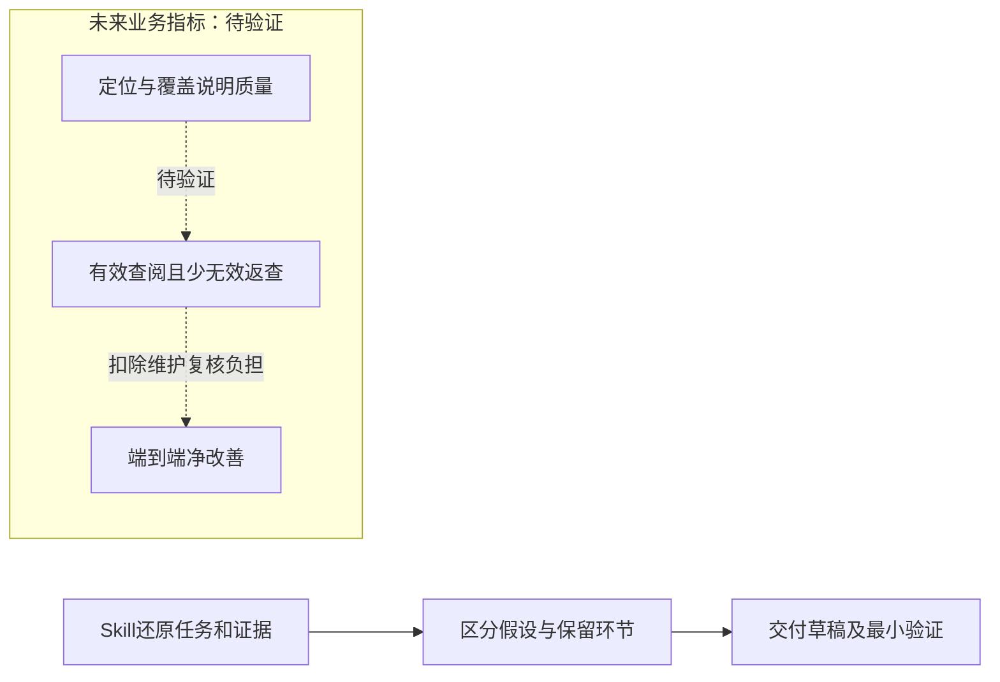

# 当前图示｜v0.3.0

事实为用户陈述，不等于现场观察；虚线标待验证关系。

## diagnosis

```mermaid
flowchart LR
 A["生产问题与完成要求"] --> B["用户陈述：逐段查PDF未定位"]
 B --> C["经验人员结合工况判断"]
 C --> D["必要讨论有效：保留"]
 B -. "待验证" .-> E["前置查阅改善价值"]
 E --> F["Unknown；非AI候选；Investigate"]
```

## problem-tree

```mermaid
flowchart TD
 A["未定位相关段落"] -. "假设" .-> B["正文有内容但难定位"]
 A -. "假设" .-> C["所查文件未覆盖"]
 B --> D["核验一个任务及原文依据"]
 C --> D
 D --> E["记录查阅负担和整理维护成本"]
 E --> F["判断改善价值；不替代专家"]
```

## workflow

```mermaid
flowchart TB
 subgraph actual["现状：用户陈述"]
 A["查生产问题"] --> B["逐段查PDF"] --> C["未定位则请教经验人员"]
 C --> D["必要时讨论形成判断"]
 end
 subgraph candidate["候选：尚未验证"]
 E["索引或覆盖说明"] --> F["依据与缺口交给专家"]
 F --> G["保留现场判断与必要讨论"]
 end
```

## metrics

```mermaid
flowchart LR
 A["Skill还原任务和证据"] --> B["区分假设与保留环节"] --> C["交付草稿及最小验证"]
 subgraph future["未来业务指标：待验证"]
 D["定位与覆盖说明质量"] -. "待验证" .-> E["有效查阅且少无效返查"]
 E -. "扣除维护复核负担" .-> F["端到端净改善"]
 end
```

