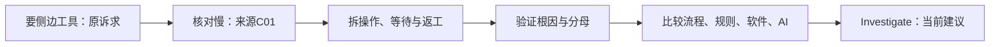
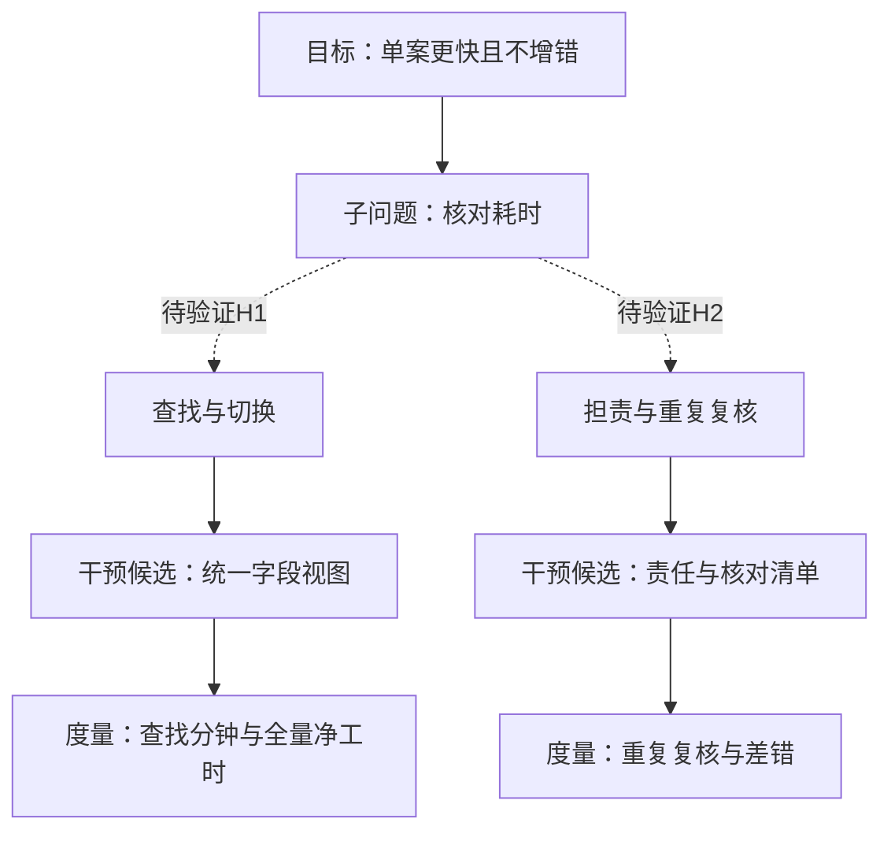
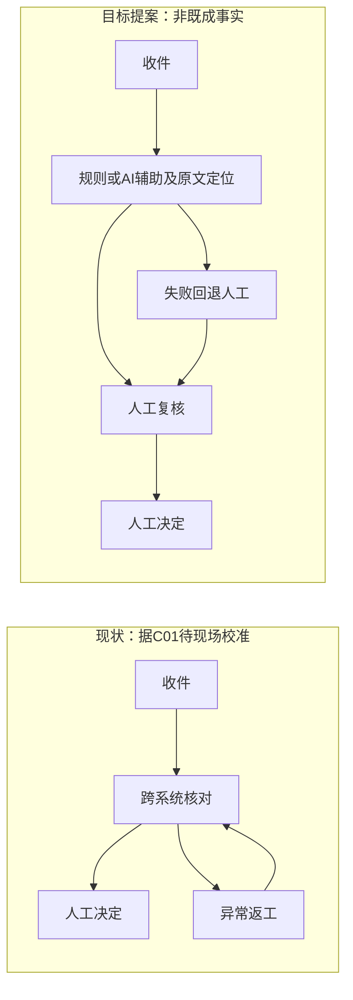
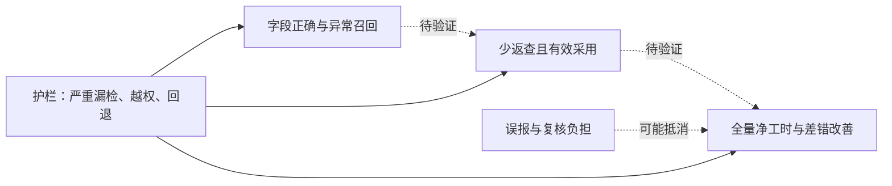

# 理赔场景图（教学提案）

## 需求到诊断

```mermaid
flowchart LR
 A["要侧边工具：原诉求"] --> B["核对慢：来源C01"]
 B --> C["拆操作、等待与返工"]
 C --> D["验证根因与分母"]
 D --> E["比较流程、规则、软件、AI"]
 E --> F["Investigate：当前建议"]
```
先补影响决策的证据，不能由工具诉求直接批准方案。

## 问题树

```mermaid
flowchart TD
 A["目标：单案更快且不增错"] --> B["子问题：核对耗时"]
 B -. "待验证H1" .-> C["查找与切换"]
 B -. "待验证H2" .-> D["担责与重复复核"]
 C --> E["干预候选：统一字段视图"]
 D --> F["干预候选：责任与核对清单"]
 E --> G["度量：查找分钟与全量净工时"]
 F --> H["度量：重复复核与差错"]
```
H1、H2为竞争解释，图不证明根因。

## 现状与目标

```mermaid
flowchart LR
 subgraph now["现状：据C01待现场校准"]
 A["收件"] --> B["跨系统核对"] --> C["人工决定"]
 B --> D["异常返工"] --> B
 end
 subgraph proposed["目标提案：非既成事实"]
 E["收件"] --> F["规则或AI辅助及原文定位"] --> G["人工复核"] --> H["人工决定"]
 F --> I["失败回退人工"] --> G
 end
```
起止边界保持一致，复核和回退成本都纳入业务指标。

## 指标因果链

```mermaid
flowchart LR
 A["字段正确与异常召回"] -. "待验证" .-> B["少返查且有效采用"]
 B -. "待验证" .-> C["全量净工时与差错改善"]
 D["误报与复核负担"] -. "可能抵消" .-> C
 E["护栏：严重漏检、越权、回退"] --> A
 E --> B
 E --> C
```
技术指标变好不保证业务收益；须验证中间机制。图中未填未知数值。
