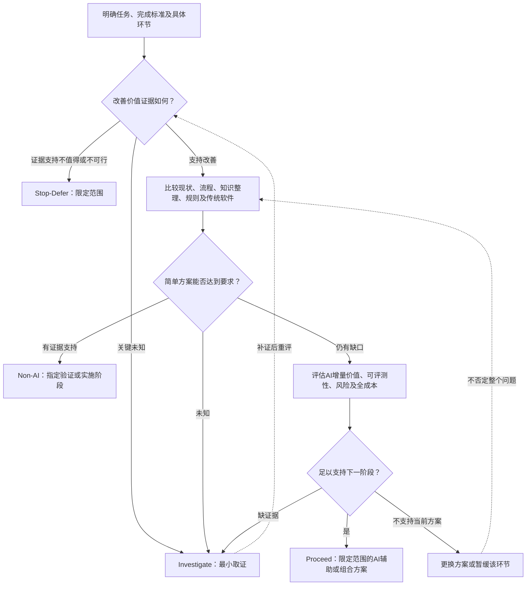

# 问题价值与干预选择

根据用户提供的七问流程图优化；以下是方法提案，非经验验证过的决策定律。

```mermaid
flowchart TD
 A["明确任务、完成标准及具体环节"] --> B{"改善价值证据如何？"}
 B -->|"关键未知"| C["Investigate：最小取证"]
 B -->|"证据支持不值得或不可行"| D["Stop-Defer：限定范围"]
 B -->|"支持改善"| E["比较现状、流程、知识整理、规则及传统软件"]
 C -. "补证后重评" .-> B
 E --> F{"简单方案能否达到要求？"}
 F -->|"有证据支持"| G["Non-AI：指定验证或实施阶段"]
 F -->|"未知"| C
 F -->|"仍有缺口"| H["评估AI增量价值、可评测性、风险及全成本"]
 H --> I{"足以支持下一阶段？"}
 I -->|"是"| J["Proceed：限定范围的AI辅助或组合方案"]
 I -->|"缺证据"| C
 I -->|"不支持当前方案"| K["更换方案或暂缓该环节"]
 K -. "不否定整个问题" .-> E
```

专业讨论有效可作为保留条件；前置查阅是否值得改善另评。非AI方案也要验证价值、适用性、风险和成本；Proceed不是生产上线授权。

[查看已渲染流程图](decision-flow.svg)。
