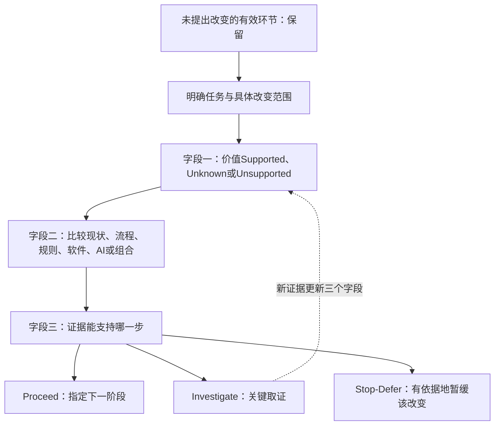

# 三个独立判断字段｜v0.3.0

同一方向可处于不同推进阶段，Non-AI不再是推进状态。

```mermaid
flowchart TD
 A["明确任务与具体改变范围"] --> B["字段一：价值Supported、Unknown或Unsupported"]
 B --> C["字段二：比较现状、流程、规则、软件、AI或组合"]
 C --> D["字段三：证据能支持哪一步"]
 D --> E["Proceed：指定下一阶段"]
 D --> F["Investigate：关键取证"]
 D --> G["Stop-Defer：有依据地暂缓该改变"]
 F -. "新证据更新三个字段" .-> B
 H["未提出改变的有效环节：保留"] --> A
```

Unknown不能直接推出Stop-Defer；保留环节不需强行做替代决定。

[已渲染图](decision-flow.svg)
